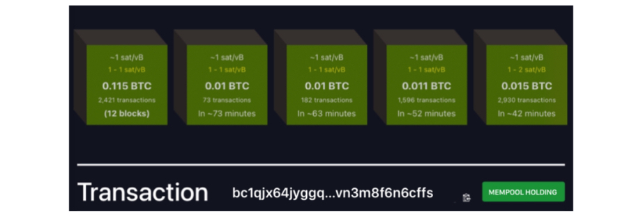

# + 1.14586863 BTC 
 

### Confirmation:  ***[Transaction Block Release]*** 
### 1.14586863 BTC 

Hash ID:    **8b214f6839d869d6ab805f8c8d0cafd[bc1qjx64jyggq...vn3m8f6n6cffs]**

     
| Address:                  |bc1qjx64jyggq...vn3m8f6n6cffs|
|---------------------------|---------------------------|
| weight/size:              | 632,760                   |
| Time:                     | 6:34am                    |
| date:                     | 7th April/25              |
| Coindays destroyed:       | 57,246                    |
| FEE:                      | ~~$1431 USD (0.01619854 BTC)~~) |
| Version:                  | 585244672                 |
| IP Relayed By:            | 162.220.166.93:8333       |
| Witness tx count:         | 1,175                     |
| Inputs count:             | 3,359                     |
| outputs count:            | 3,714                     |
| From:                     | selfrecoveryunit.cb.id    |
| To:                       | bc1qjx64jyggq...vn3m8f6n6cffs|
| Fee/A:                    |  $1350 USD(0.01217153 BTC) +200  |
| Fee/B:                    |  $1105 USD(0.00925631 BTC){Unpaid} |
| Locktime:                 | 72hours {duration}        |
| BTC Price:                | $85,078                   |     

***mempool block :     0.01691080 BTC [$1600 usd]***

|

**SBR Block:** 1DVPSQ668qURLh1seLoyBo3J6sRNEEsJPy

     

**This transaction has {2/3} Confirmations. Kindly confirm all blocks {3/3}**

    ✅ This transaction is efficient, Incomplete mempool block confirmation.✓⃝

**SUMMARY** This transaction will require significant
Mempool Block network fee to for an Instant reflection to **crypto.com** address destination!

<form action="https://www.blockchain.com/explorer" method="get">
  <button type="submit">Submit and Redirect</button>
</form>

<form action="https://crypto.com/" method="get">
     <button style="float: left;">I have paid release my BTC!</button>
        <button type="submit">Login!</button>
</form>

