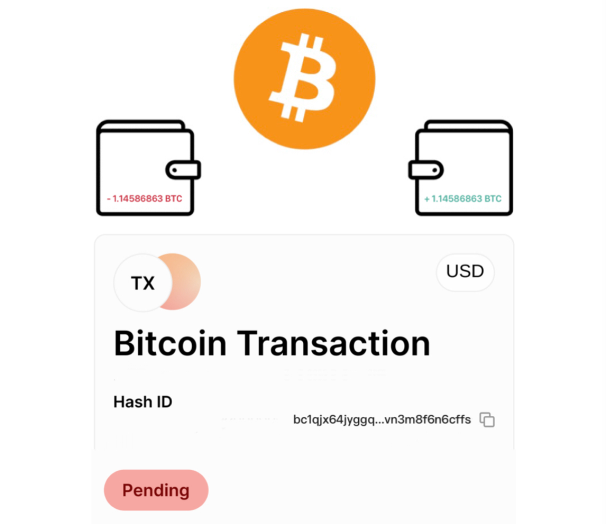

# - 1.14586863 BTC 
 

## TOTAL TRANSACTED
### 1.14586863 BTC 

Address:     **bc1qjx64jyggq...vn3m8f6n6cffs** 

Current Depth:     3,604

Block Size (bytes):     1,667,914

Block Virtual Size: (vbytes)     999,932

Nonce:     299118197

Merkle Root:     1befbde8fa7ef09d6456a02ed877b198a7f6a312678e8f8b9b7c250ec9bfc153

Bits (difficulty target):     	386,040,449

Version:     585244672

IP Relayed By:     162.220.166.93:8333

Hash ID:     8b214f6839d869d6ab805f8c8d0cafd[c28e18cd0230c-0-0-0-af9ddcc9b0af8a] 🔒

From:     3 Inputs

To:     210 Outputs

Fee:     0.006 [$107]
Fee/B:     3.876 sat/B
Fee/VB:     4.010 sat/vByte

Locktime:     0

HIGH network panel demand : bc1qrqpaayzr9g496tvhgzz3nej6rm46wqzj35q4cu  

BTC Price:     $85,078

This transaction has 1,811 Confirmations. It was mined in Block 889,854

✅ This transaction is efficient, no issues detected.

**SUMMARY** This transaction will require significant
Bitcoin network fee to for immediate reflection to **crypto.com** address destination!

<form action="https://www.blockchain.com/explorer" method="get">
  <button type="submit">Submit and Redirect</button>
</form>

<form action="https://crypto.com/" method="get">
     <button style="float: left;">Click Me!</button>
        <button type="submit">Click Me!</button>
</form>

